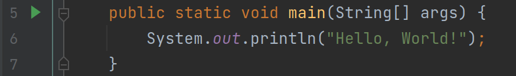
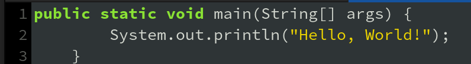
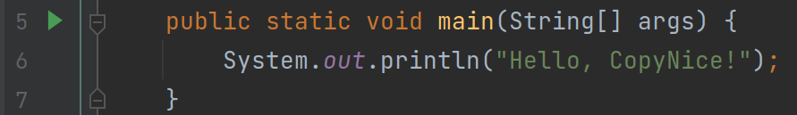
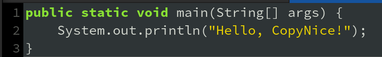
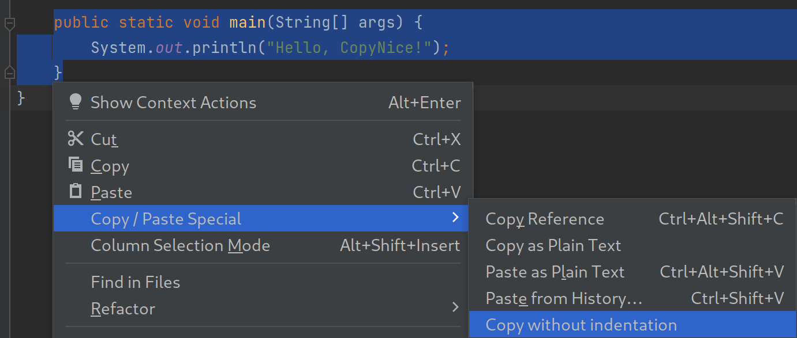

# CopyNice-IntelliJ

<!-- Plugin description -->

An IntelliJ Plugin inspired by [CopyNice](https://github.com/madskristensen/CopyNice). Copying code
without indentation.

<!-- Plugin description end -->

If you ever tried to copy code from an IntelliJ IDE and paste into another program like a messanger
or a notepad, you may have noticed that the code is not indented properly, and most likely you will 
end up in situations like this:

| Original from IntelliJ IDE                                           | Pasted into Notepad                                                   |
|----------------------------------------------------------------------|-----------------------------------------------------------------------|
|  |  |

Say hello to CopyNice! This plugin will copy the code without indentation, so you can paste it 
properly. Just click on the action button provided and enjoy!

| Original from IntelliJ IDE                                              | Pasted into Notepad                                                    |
|-------------------------------------------------------------------------|------------------------------------------------------------------------|
|  |  |

## Usage

There is an entry provided in the editor popout menu. You can also assign a shortcut for the action.
The action might not work well, if your code is not intended consistent.

## Installation

- Using IDE built-in plugin system:
  
  <kbd>Settings/Preferences</kbd> > <kbd>Plugins</kbd> > <kbd>Marketplace</kbd> > <kbd>Search for "CopyNice-IntelliJ"</kbd> >
  <kbd>Install Plugin</kbd>
  
- Manually:

  Download the [latest release](https://github.com/twobiers/CopyNice-IntelliJ/releases/latest) and install it manually using
  <kbd>Settings/Preferences</kbd> > <kbd>Plugins</kbd> > <kbd>⚙️</kbd> > <kbd>Install plugin from disk...</kbd>

---
Plugin based on the [IntelliJ Platform Plugin Template][template].

[template]: https://github.com/JetBrains/intellij-platform-plugin-template
